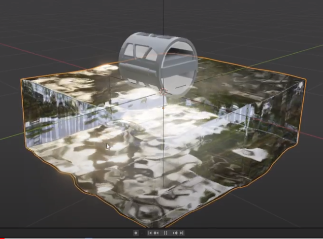
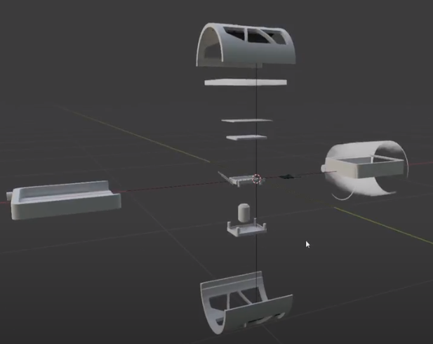
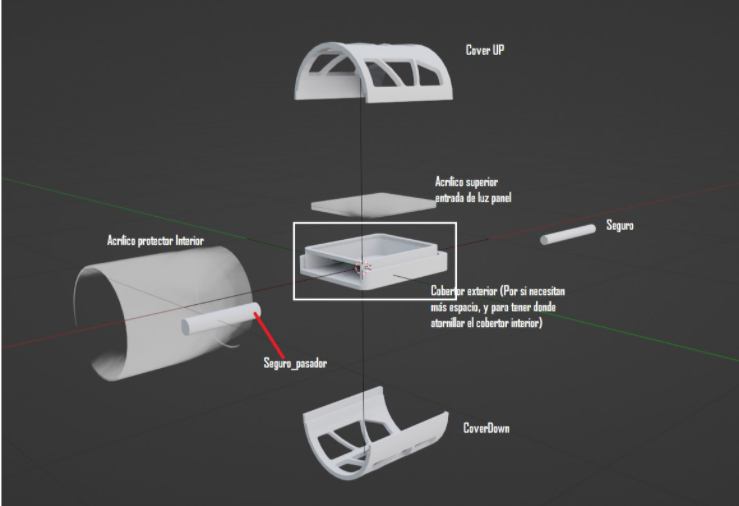

# flotador-gnu-linux-final
Este proyecto es un modelo de flotador para medir la calidad de agua, desarrollado en software libre (Blender).

## Imagenes del modelo del proyecto
### Render del proyecto

### Desacople de piezas del flotador

### Especificacion de piezas

